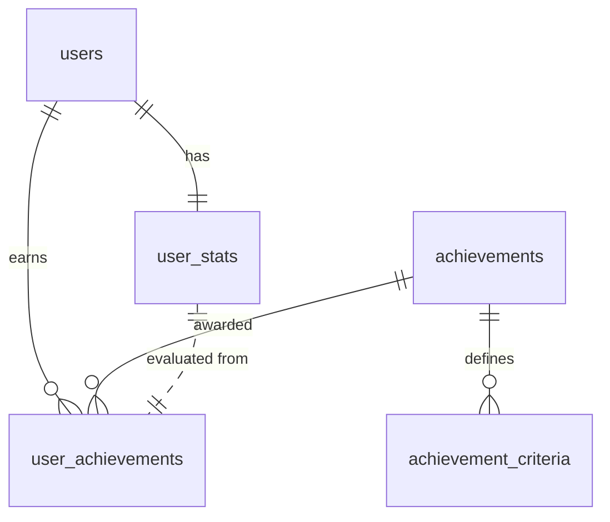

# Achievements DB Design

## Proposed achievements (stats-driven)
1. `first_game`: Play 1 game (`user_stats.games_played >= 1`).
1. `first_win`: Win 1 game (`games_won >= 1`).
1. `marathon_20`: Play 20 games (`games_played >= 20`).
1. `marathon_50`: Play 50 games (`games_played >= 50`).
1. `card_collector`: Purchase 50 development cards (`total_cards_purchased >= 50`).
1. `card_mogul`: Purchase 100 development cards (`total_cards_purchased >= 100`).
1. `winner_10`: Win 10 games (`games_won >= 10`).
1. `prestige_hunter`: Reach a single-game prestige score of 18+ (`highest_prestige_score >= 18`).
1. `prestige_hoarder`: Accumulate 200 lifetime prestige points (`total_prestige_points >= 200`).
1. `speedrunner`: Fastest win under 15 minutes (`fastest_win_time <= 900` seconds).
1. `swift_victory`: Fastest win under 10 minutes (`fastest_win_time <= 600` seconds).
1. `noble_courtier`: Acquire 10 nobles (`total_nobles_acquired >= 10`).
1. `noble_diplomat`: Acquire 25 nobles (`total_nobles_acquired >= 25`).
1. `gem_specialist`: Win 5 games with a recorded favorite gem type (`games_won >= 5` and favorite_gem_type IS NOT NULL).
1. `consistent_winner`: Win rate of at least 60% with 10+ games (`games_won / games_played >= 0.6` and `games_played >= 10`).

## Schema
### `achievements` (catalog)
- `id INTEGER PRIMARY KEY AUTOINCREMENT`
- `code TEXT UNIQUE NOT NULL` (stable identifier for logic/UI)
- `name TEXT NOT NULL`
- `description TEXT NOT NULL`
- `category TEXT NOT NULL` (e.g., milestone, skill, speed)
- `icon TEXT` (relative asset key)
- `sort_order INTEGER DEFAULT 0`
- `unlock_type TEXT NOT NULL CHECK (unlock_type IN ('threshold', 'ratio', 'composite'))`
- `created_at INTEGER NOT NULL`
- `updated_at INTEGER NOT NULL`

### `achievement_criteria` (1..n per achievement; normalized conditions)
- `id INTEGER PRIMARY KEY AUTOINCREMENT`
- `achievement_id INTEGER NOT NULL REFERENCES achievements(id) ON DELETE CASCADE`
- `stat_key TEXT NOT NULL` (one of the `user_stats` columns)
- `comparator TEXT NOT NULL CHECK (comparator IN ('>=', '<=', '>', '<', '='))`
- `target_value REAL NOT NULL`
- `denominator_stat_key TEXT` (for ratios like win rate; null for simple thresholds)
- `min_sample_size INTEGER` (guards small denominators; optional, e.g., require 10 games for win rate)
- `notes TEXT` (human-readable hint for QA/debugging)

### `user_achievements` (per-user state)
- `id INTEGER PRIMARY KEY AUTOINCREMENT`
- `user_id TEXT NOT NULL REFERENCES users(id) ON DELETE CASCADE`
- `achievement_id INTEGER NOT NULL REFERENCES achievements(id) ON DELETE CASCADE`
- `unlocked_at INTEGER NOT NULL`
- `progress_value REAL` (last evaluated value for the primary stat/ratio)
- `progress_detail TEXT` (optional JSON snapshot of stats used for unlock; aids support/debug)
- `notified_at INTEGER` (null until an unlock toast/notification is sent)
- `UNIQUE(user_id, achievement_id)`

### Indexes
- `CREATE INDEX idx_achievement_code ON achievements(code);`
- `CREATE INDEX idx_user_achievements_user ON user_achievements(user_id);`
- `CREATE INDEX idx_user_achievements_achievement ON user_achievements(achievement_id);`

## Notes on evaluation
- At game end, after `user_stats` updates, evaluate achievements by joining `achievements` → `achievement_criteria` and comparing criteria against the latest `user_stats` row for the player.
- For `unlock_type = 'ratio'`, compute `stat_key / denominator_stat_key` and honor `min_sample_size` to avoid noisy unlocks.
- For `unlock_type = 'composite'`, require all associated criteria rows to pass.
- Writes to `user_achievements` must be idempotent (upsert on `user_id` + `achievement_id`), and unlock events/toasts should key off newly inserted rows.

## ER diagram

